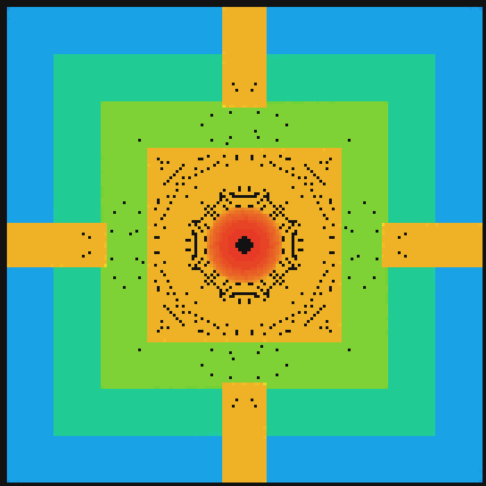

# Scan Candi with OctoMap Rust

[](https://github.com/Shannon-Dynamics/scan_candi_with_octomap_rust/actions/workflows/ci.yml)
[](LICENSE)

A reference application for
[`octo_map_rust`](https://github.com/Shannon-Dynamics/octo_map_rust): a
simulated drone flies a scripted orbit around a structure inside MuJoCo,
renders a depth image at every waypoint, and folds those frames into a
probabilistic 3D occupancy map.

It exists to answer a question the library's own documentation cannot: *what
does it take to apply this to a real spatial-mapping problem?*

Every part of the runtime path is **Rust**. Python appears exactly once,
offline, to convert an optional source mesh in Blender.



*Output of the Quick Demo below: four terraces, four staircases and a domed
summit, reconstructed from simulated depth images.*

---

## Quick Demo

The shortest path from a clone to a 3D occupancy map. **No ROS 2, no external
assets, no conversion step.**

### Requirements

| | |
|---|---|
| Rust | 1.85 or newer (the crates use edition 2024) |
| MuJoCo | Downloads itself on the first build, ~19.5 MB |
| A GPU/OpenGL context | For offscreen depth rendering. WSLg counts |
| [`octo_map_rust`](https://github.com/Shannon-Dynamics/octo_map_rust) | Checked out **beside** this repository — the mapping library is a path dependency until it is published |
| Rerun viewer 0.35.0 | Optional, to replay the recording |

### Clone

Both repositories, side by side:

```bash
git clone https://github.com/Shannon-Dynamics/octo_map_rust
git clone https://github.com/Shannon-Dynamics/scan_candi_with_octomap_rust
cd scan_candi_with_octomap_rust
```

```text
<workspace>/octo_map_rust/
<workspace>/scan_candi_with_octomap_rust/     <- you are here
```

### Build

MuJoCo needs an absolute download directory at build time, and its library on
the loader path at run time:

```powershell
# Windows (PowerShell)
$env:MUJOCO_DOWNLOAD_DIR = "$PWD\.mujoco"
$env:Path = "$PWD\.mujoco\mujoco-3.9.0\bin;$env:Path"
```

```bash
# Linux / WSL
export MUJOCO_DOWNLOAD_DIR="$PWD/.mujoco"
export LD_LIBRARY_PATH="$MUJOCO_DOWNLOAD_DIR/mujoco-3.9.0/lib:${LD_LIBRARY_PATH:-}"
```

```bash
cargo build --release --config 'profile.release.lto=false'
```

The `lto=false` override is not optional in practice: with LTO on, one of
Rerun's dependencies takes impractically long to compile. The manifest keeps
`lto = true` to state the intent —
[`docs/runbooks/troubleshooting.md`](docs/runbooks/troubleshooting.md).

### Run

```bash
cargo run --release --config 'profile.release.lto=false' -p candi-sim --bin live_scan
```

### What You Should See

288 waypoints, then a summary comparing the two maps that were built from the
same points:

```text
scene: <workspace>/scan_candi_with_octomap_rust/assets/demo/demo_scene.xml
candi 15.00 x 15.00 x 6.00 m | orbit r=16.53 m | 288 waypoints
...
                                 octomap-core      hash grid
occupied leaves / entries               47244          76920
occupied voxels at 0.1 m                47244          76920
nodes / entries held                  1233989          76920

free-space carving: octomap-core on, hash grid off
```

(The summary also prints a per-frame insertion time for each map. It is there
so a maintainer can notice a change between runs, not as a property of either
implementation.)

and three artefacts:

| Artefact | What it is |
|---|---|
| `out/map_top.png` | The map from above — terraces, staircases, summit |
| `out/map_side.png` | The map from the side — the stepped profile |
| `out/candi_scan.rrd` | A 288-frame Rerun recording: `rerun out/candi_scan.rrd` |

The two maps differ here because only the octree is carving free space: a ray
passing through erases a voxel that one viewpoint saw as occupied while others
prove the space empty. For a like-for-like run:

```bash
cargo run --release --config 'profile.release.lto=false' -p candi-sim --bin live_scan -- --octree-no-carve
```

That finishes in under two seconds and the two maps agree **exactly**:

```text
                                 octomap-core      hash grid
occupied leaves / entries               60288          76920
occupied voxels at 0.1 m                76920          76920
```

76,920 voxels from both, out of 2.9 million points — two independently written
implementations, same input, same answer. The leaf/voxel gap on the octree side
is pruning: one merged node stands for eight base voxels, or eight thousand.

### Next Steps

- [`docs/SCANNING_TUTORIAL.md`](docs/SCANNING_TUTORIAL.md) — the workflow
  explained step by step, including what each parameter changes.
- [`media/demo/README.md`](media/demo/README.md) — how to read the output, and
  why there is a small unobserved patch at the summit.
- [Demo 2](#demo-2--ros-2-integration) — the same pipeline across a ROS 2 graph.

---

## What This Demonstrates

For someone evaluating `octomap-core`, this repository shows:

- **Turning a depth image into a world-frame point cloud** — the unprojection,
  the frame conventions, and the two traps that make a reconstruction subtly
  wrong ([`docs/03-pipeline.md`](docs/03-pipeline.md)).
- **Feeding scans into the library from a moving sensor** — one insertion per
  waypoint, from a sensor origin that moves, which is what makes free space
  meaningful.
- **Filtering before insertion.** Without a ground-plane filter the map is
  mostly floor and the structure disappears inside a wide disc
  ([ADR-0007](docs/decisions/0007-ground-plane-filter.md)).
- **Reading a map back out** — walking occupied leaves, and why a leaf is not
  always one voxel.
- **Publishing to existing tooling.** `octomap_binary` is the standard OctoMap
  message, so RViz reads this map without knowing it was built in Rust.
- **Validating an occupancy map against an independent implementation**, which
  is what the comparison table above is.

What it does **not** do: SLAM, localization, path planning, or driving a real
sensor. The drone follows a precomputed path, and its pose is an input rather
than a result.

## Technology Stack

Split by which demo needs it.

### Quick Demo

| Component | Role |
|---|---|
| Rust + Cargo | The whole runtime path |
| MuJoCo 3.9.0 via `mujoco-rs 5.0.0` | Physics-free kinematic simulation and offscreen depth rendering |
| `octomap-core` | The occupancy octree — the library being demonstrated |
| `candi-octomap-node` | This project's hash-grid map, the comparison baseline |
| `rerun 0.35` (`sdk` feature) | The 3D recording |
| `png 0.18` | The orthographic projection images |

### ROS 2 Demo, in addition

| Component | Role |
|---|---|
| ROS 2 Jazzy | The middleware |
| `r2r 0.9` | Rust bindings, generated from a sourced ROS 2 installation |
| `sensor_msgs/PointCloud2`, `tf2_msgs/TFMessage`, `octomap_msgs/Octomap` | The wire formats |
| `octomap-ros` | Message conversions that do not themselves depend on ROS |

### Offline asset preparation, optional

| Component | Role |
|---|---|
| Blender 5.x + Python | Converts a source mesh for the non-demo scene |

**Python is not part of the runtime mapping pipeline.** It runs once, offline,
and only if you are scanning your own mesh rather than the demo scene.

## System / Data Flow

### Demo 1 — Quick Demo

```text
MuJoCo scene (assets/demo/demo_scene.xml)
        │
        ▼
depth camera, 640x480 per waypoint
        │
        ▼
unprojection to a world-frame point cloud
        │
        ▼
ground-plane filter
        │
        ├──────────────► octomap-core OcTree ────┐
        │                (occupied / free /      │
        │                 unknown)               ├──► Rerun recording
        └──────────────► hash grid ──────────────┘    + PNG projections
                         (comparison baseline)
```

One process, no middleware. This is the path to read if the library is what
brought you here.

### Demo 2 — ROS 2 integration

```text
MuJoCo ──► candi_publisher ──► /cloud  (sensor_msgs/PointCloud2)
                          └──► /tf     (tf2_msgs/TFMessage)
                                 │
                                 ▼
                          candi_mapper
                                 │
                    ┌────────────┴────────────┐
                    ▼                         ▼
          octomap-core OcTree           hash grid
                    │
                    ▼
          octomap_binary (octomap_msgs/Octomap) ──► RViz, any consumer
```

Both nodes live in `ros2/`, a separate Cargo workspace, because everything in
it needs ROS 2 sourced at build time —
[ADR-0006](docs/decisions/0006-separate-ros2-workspace.md). Running it:
[`docs/runbooks/wsl-ros2.md`](docs/runbooks/wsl-ros2.md).

## Environment Support

| Environment | Quick Demo | ROS 2 Demo | Status |
|---|---|---|---|
| Windows 11 native | ✅ | ❌ — `r2r` needs a ROS 2 installation | Verified |
| WSL2 Ubuntu 24.04 + WSLg | ✅ | ✅ with ROS 2 Jazzy | Verified |
| Linux native | Expected to work | Expected to work with ROS 2 Jazzy | Not verified here |
| macOS | Unknown | Unknown | Not verified |

Versions the above was verified against: MuJoCo 3.9.0, Rerun 0.35.0, ROS 2
Jazzy. Rust 1.85+ is required by edition 2024; no lower bound has been
established by testing, so no MSRV is declared for this repository. The mapping
library declares its own.

## Input Data

The Quick Demo needs no input: its scene is
[`assets/demo/demo_scene.xml`](assets/demo/README.md), committed, built from
MuJoCo primitives, and covered by this repository's licence.

To scan your own geometry instead:

| Input | Where it comes from |
|---|---|
| A source mesh | Yours. Converted by `scripts/convert_glb.py` in headless Blender |
| `assets/skydio_x2/` | The Skydio X2 model from MuJoCo Menagerie (Apache-2.0), if you want the detailed drone |
| `scene/candi_scene.xml` | Committed. The MJCF that assembles a mesh-based scene |

Then point the scan at it:

```bash
cargo run --release -p candi-sim --bin live_scan -- --scene scene/candi_scene.xml
```

Details: [`assets/README.md`](assets/README.md) and
[`docs/runbooks/asset-conversion.md`](docs/runbooks/asset-conversion.md).

**The Borobudur mesh this project was originally built around is not
distributed here**, and neither are recordings derived from it. Its
redistribution rights are not established.

## Running the Example

| Command | What it does |
|---|---|
| `cargo run --release -p candi-sim --bin live_scan` | The Quick Demo: 288 waypoints, both maps, `.rrd`, two PNGs |
| `... --bin live_scan -- --octree-no-carve` | Endpoints only, so the two maps do identical work |
| `... --bin live_scan -- --scene <path>` | Scan a different MJCF |
| `... --bin live_scan -- --connect` | Stream into a running Rerun viewer instead of writing a file |
| `... --bin live_scan -- --mesh [path]` | Overlay the source geometry in the recording |
| `./ros2/run_demo.sh` | The ROS 2 path: both nodes, both maps, the comparison table |
| `cargo run -p candi-sim --example view_scene` | The interactive MuJoCo viewer |
| `cargo run -p candi-sim --example smoke_test` | Checks that MuJoCo loads, steps, tracks a mocap body and renders depth |

## How `octo_map_rust` Is Used

In `crates/candi-sim/src/bin/live_scan.rs` (the Quick Demo) and
`ros2/candi_mapper/src/main.rs` (the ROS 2 path). Abridged from the former:

```rust
use octomap_core::{OcTree, Point3, PointCloud};

let mut octree = OcTree::new(RESOLUTION as f64)?;      // 0.1 m voxels

// Per waypoint: the sensor origin is the camera pose, the points are the
// unprojected depth image. insert_point_cloud traces each ray, so it records
// the free space between sensor and surface as well as the surface.
let sensor = Point3::new(origin[0], origin[1], origin[2]);
let scan: PointCloud = structure.iter().map(|p| Point3::new(p[0], p[1], p[2])).collect();
octree.insert_point_cloud(&scan, sensor, MAX_RANGE as f64, false, true);

// Reading the map back: walk the leaves, keep the occupied ones, ask the tree
// geometry where each is and how large. Size matters — pruning merges blocks.
let threshold = octree.sensor().occupancy_thres_log();
for visit in octree.iter_leaves().filter(|v| v.value().log_odds >= threshold) {
    let centre = octree.geometry().key_to_coord(visit.key());
    let size = octree.geometry().node_size(visit.depth());
}
```

The sensor model is left at the library's defaults — `prob_hit` 0.7,
`prob_miss` 0.4 — because those are what the hash grid was written to, which is
what makes the two maps comparable.

The hash grid in `crates/candi-octomap-node` is **not** part of the library. It
is kept because deleting it would delete the comparison that validates both
([ADR-0009](docs/decisions/0009-dual-map-comparison.md)).

## Project Structure

```
scan_candi_with_octomap_rust/
├─ crates/
│  ├─ candi-sim/            # MuJoCo scene, orbit, depth → cloud, live_scan
│  └─ candi-octomap-node/   # Hash-grid map, PointCloud2 parser, palette
├─ ros2/                    # Separate Cargo workspace — needs ROS 2 sourced
│  ├─ candi_publisher/      # orbit → /cloud + /tf
│  └─ candi_mapper/         # octree + hash grid + Rerun + octomap_binary
├─ assets/demo/             # The self-contained Quick Demo scene
├─ scene/candi_scene.xml    # MJCF for a mesh-based scene
├─ scripts/convert_glb.py   # Blender headless asset conversion (offline)
├─ docs/                    # Architecture, pipeline, results, tutorial, ADRs
└─ media/                   # Demo output and recordings
```

## Memory Safety

The mapping library this is built on contains no `unsafe`, and neither does the
code in `crates/`. That is worth stating precisely, because this application
does not inherit the same guarantee end to end:

- **`candi-octomap-node`** has no dependencies at all and no `unsafe`. Its
  `PointCloud2` decoder validates every offset against the buffer length and
  returns a `ParseError` for a truncated message rather than panicking.
- **`octomap-core`**, from the library repository, forbids `unsafe` at the
  workspace level and is verified under Miri.
- **`candi-sim`** links MuJoCo through `mujoco-rs`, an FFI binding to a C
  library. That boundary exists here and is not covered by any no-`unsafe`
  claim.
- **`ros2/`** links `r2r`, which binds a C++ ROS 2 client library. Same caveat.

So: the mapping and geometry logic is memory-safe Rust with the compiler
enforcing it; the simulator and middleware bindings are not. The split is
deliberate — the crates without dependencies carry the logic worth testing, and
they are testable in CI precisely because nothing native is in the way. The
library's own policy is in
[`SAFETY.md`](https://github.com/Shannon-Dynamics/octo_map_rust/blob/main/SAFETY.md).

## Current Limitations

- **The drone is kinematic, not physics-controlled.** It is a MuJoCo mocap body
  moved along a precomputed path. The flight path is an input, not a result.
- **The sensor is simulated.** Depth comes from an offscreen render with no
  noise model, no dropouts and no calibration error. Real sensor data is
  messier, and free-space carving matters more there than it does here.
- **The public demo uses a synthetic scene.** It is a stepped pyramid built
  from primitives, not scanned geometry.
- **The original scan assets cannot be redistributed**, so mapping the real
  temple requires supplying the mesh yourself.
- **The ROS 2 path is Linux-only** — `r2r` needs a ROS 2 installation.
- **No SLAM, localization or planning.** The pose is known exactly because it
  was chosen.
- **`octomap-core` is a path dependency**, so both repositories must be checked
  out side by side until the library is published.
- **Timings were taken with LTO disabled** and are upper bounds —
  [`docs/05-results.md`](docs/05-results.md).

## Roadmap

[`ROADMAP.md`](ROADMAP.md) — what a next iteration would add, in phases and
without dates.

## Contributing

[`CONTRIBUTING.md`](CONTRIBUTING.md) covers the build, the two-repository
split, and which repository a given change belongs in. In short: mapping
library changes go to `octo_map_rust`; anything about the simulation, the
scene or the demo belongs here.

## Security

[`SECURITY.md`](SECURITY.md) — what is in scope, and how to report privately.

## Credits

- **OctoMap** — Hornung, Wurm, Bennewitz, Stachniss and Burgard, *OctoMap: An
  Efficient Probabilistic 3D Mapping Framework Based on Octrees*, Autonomous
  Robots, 2013. The occupancy semantics here follow that paper.
- **MuJoCo** — Google DeepMind. **mujoco-rs** — David Hozic.
- **Skydio X2 model** — MuJoCo Menagerie, Google DeepMind (Apache-2.0), used
  only by the mesh-based scene.
- **Rerun** — Rerun.io. **r2r** — ROS 2 bindings for Rust.

## License

Licensed under the [Apache License 2.0](LICENSE). Third-party attributions are
listed in [`NOTICE`](NOTICE), which must be redistributed alongside the
licence.
